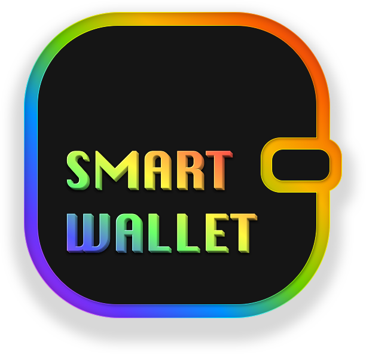
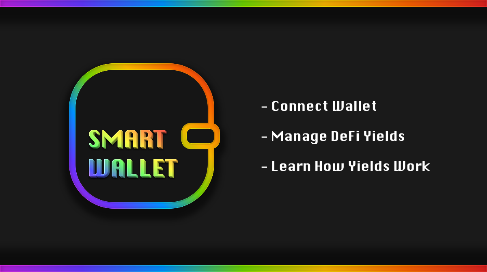

# ETHGLOBAL HACKATHON Spring 2022 - Smart Wallet

 
 

## Run

Run as HTTP server.

 
 

## Description

Smart Wallet provides an easy way to manage your DeFi yield instruments and helps you learn more about how DeFi yields work using "learn mode" (testnet).

Features:
- Lending Options on Aave V3 for ETH, WBTC, DAI and more
- Chains: Polygon, Rinkeby and Mumbai
- Learn mode (testnet)

 

 
 

## Tech

- Aave V3 Smart Contracts
- Transak
- Spheron and Filecoin (IPFS)
- WalletConnect
- Vanilla JS (no React, no Vue, no BS)
- Web3.js
- Moralis