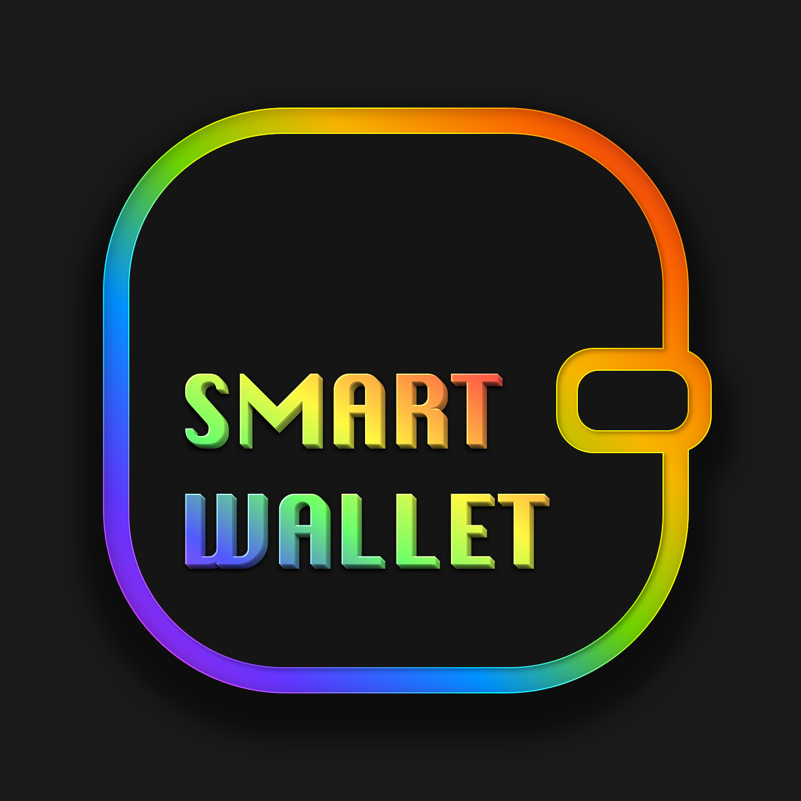

# ETHGLOBAL HACKATHON Spring 2022 - Smart Wallet

 
 

## Run

Run with simple HTTP server.

 
 

## Description

Smart Wallet provides access to the most popular and secure DeFi Yield instruments. Manage your DeFi instruments with an easy to use dashboard and learn how DeFi yields work.

Features:
- Wallet Connect
- DeFi Yields on Aave V3 for ETH, WBTC, DAI.
- Access Ethereum (mainnet, rinkeby) and Polygon (mainnet, mumbai)
- Learn how DeFi yields work

 

 
 

## Tech

- Vanilla JS (no React, no Vue, no BS)
- WalletConnect
- Web3.js
- Moralis
- Transak
- Aave V3 API
- Spheron (IPFS/Filecoin) Deployment & Hosting